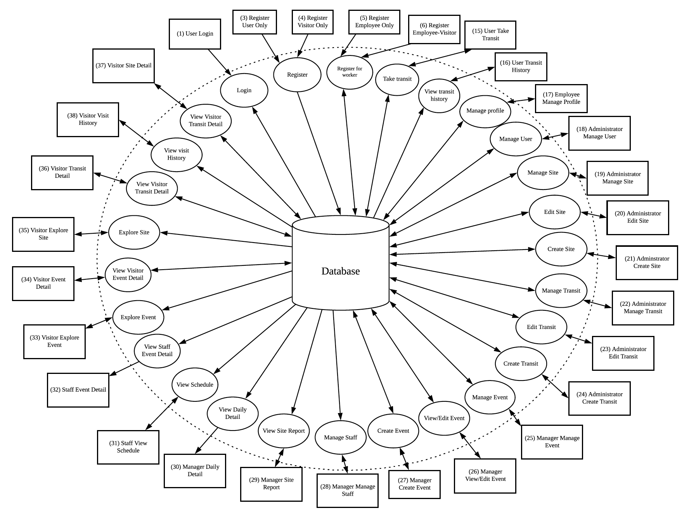
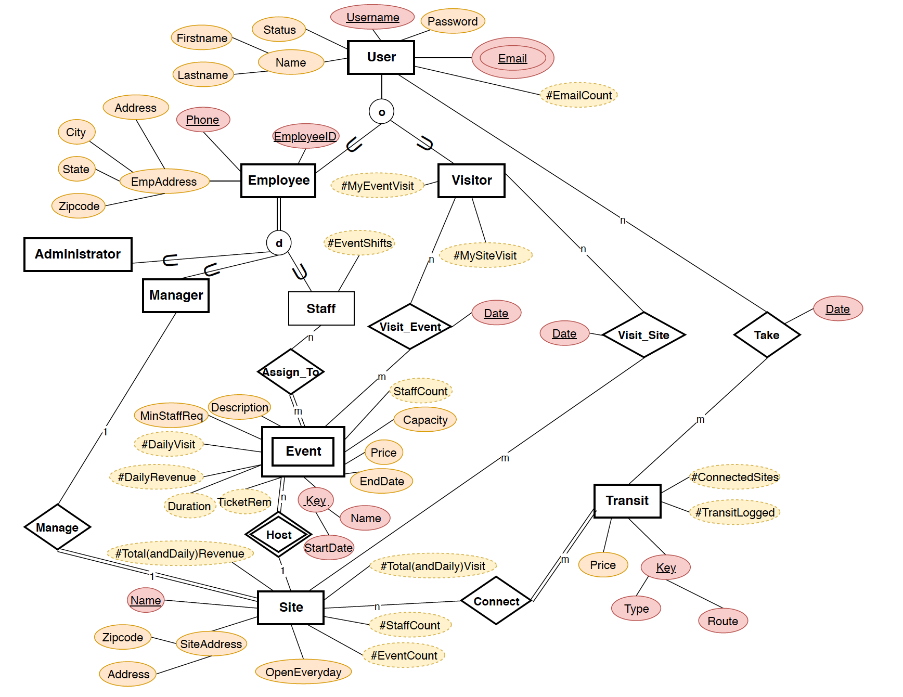

# atlanta-beltline

Atlanta Beltline is an application implemented by using JavaFX and MySQL. The application stores information about the Atlanta BeltLine sites and events. Also, this application keeps track of the visitors who visit the different sites and events, users who take transits that connect various sites, and the employees who work in the Atlanta BeltLine system.

Install
-------
You should have MySQL Workbench [MySQL_Workbench](https://dev.mysql.com/downloads/workbench/) and MySQL Sever [MySQL_Sever](https://dev.mysql.com/downloads/mysql/).
Using latest version v8.0 is recommended.

Also, you should have JDK.
If you currently use JDK11 or more, you should download JavaFX library additionally.
The download links are provided here:
[JDK11](https://www.oracle.com/technetwork/java/javase/downloads/jdk11-downloads-5066655.html), 
[JavaFX](https://gluonhq.com/products/javafx/)

Run
----
In order to compile type this commend into your terminal.
```shell
javac --module-path javafx-sdk-11.0.2/lib --add-modules=javafx.controls main.java
```
Run
```shell
java --module-path javafx-sdk-11.0.2/lib --add-modules=javafx.controls main.java
```
Information Flow Diagram(IFD)
-----------------------------


EER Diagram
-----------


Schema
------
```
User = (__Username__, Password, Status, Firstname, Lastname)

UserEmail = (Username [FK1], __Email__)
FK1: Username -> User.Username

Visitor = (__Username__ [FK2])
FK2: Username -> User.Username

Employee = (__Username__ [FK3], EmployeeID, Phone, EmployeeAddress, EmployeeCity,
EmployeeState, EmployeeZipcode)
FK3: Username -> User.Username

Administrator = (__Username__ [FK4])
FK4: Username -> Employee.Username

Staff = (__Username__ [FK5])
FK5: Username -> Employee.Username

Manager = (__Username__ [FK6])
FK6: Username -> Employee.Username

Site = (__SiteName__, SiteAddress, SiteZipcode, OpenEveryday, ManagerUsername [FK7])
FK7: ManagerUsername -> Manager.Username

Event = (__EventName__, __StartDate__, __SiteName__ [FK8], EndDate, EventPrice, Capacity, Description,
MinStaffRequired)
FK8: SiteName -> Site.SiteName

AssignTo = (__StaffUsername__ [fk9], __EventName__ [FK10], __StartDate__ [fk10], __SiteName__ [fk10])
FK9: StaffUsername -> Staff.Username
FK10: (EventName, StartDate, SiteName) -> Event.(EventName, StartDate, SiteName)

Transit = (__TransitType__, __TransitRoute__, TransitPrice)

Connect = (__SiteName__ [FK11], __TransitType__ [FK12], __TransitRoute__ [FK12])
FK11: SiteName -> Site.SiteName
FK12: (TransitType, TransitRoute) -> Transit.(TransitType, TransitRoute)

TakeTransit = (__Username__ [FK13], __TransitType__ [FK14], __TransitRoute__ [FK14], __TransitDate__)
FK13: Username -> User.Username
FK14: (TransitType, TransitRoute) -> Transit.(TransitType, TransitRoute)

VisitSite = (__VisitorUsername__ [FK15], __SiteName__ [FK16], __VisitSiteDate__)
FK15: VisitorUsername -> User.Username
FK16: SiteName -> Site.SiteName

VisitEvent = (__VisitorUsername__ [FK17], __EventName__ [FK18], __StartDate__ [FK18], __SiteName__ [FK18],
__VisitEventDate__)
FK17: VisitorUsername -> User.Username
FK18: (EventName, StartDate, SiteName) -> Event.(EventName, StartDate, SiteName)
```

Additional information
----------------------
To setting environment in IntelliJ: [Setting](https://stackoverflow.com/questions/52682195/how-to-get-javafx-and-java-11-working-in-intellij-idea)

Authors
-------
Team Eleven (Daewoong Ko, Woongrae Cho, Hee Jun Park, Jaemo Koo, Heeseon Kim)
